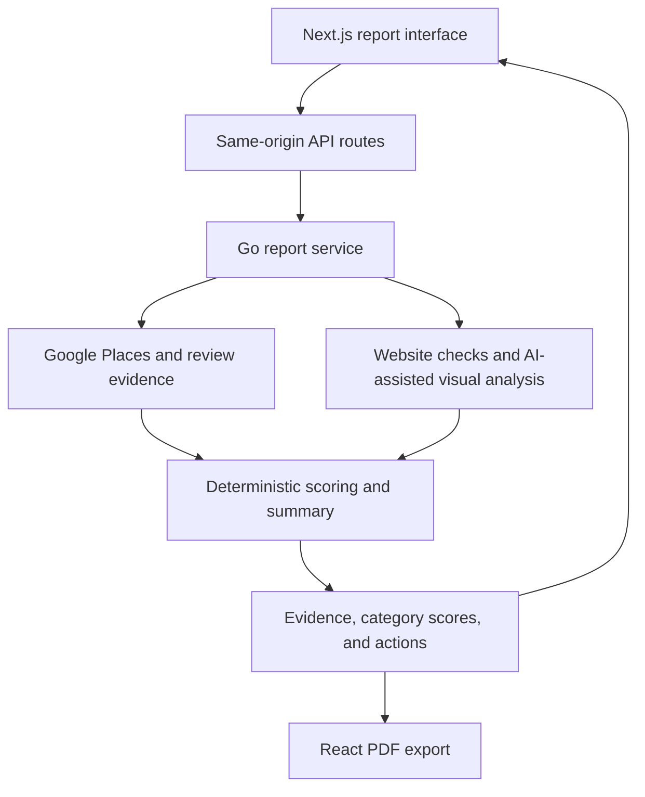

# Restaurant Digital Footprint Analyzer

Turns public restaurant listings, reviews, and website evidence into a scored report with prioritized improvements. The goal is to make the reasoning inspectable: each finding should trace back to evidence, and missing evidence should remain visible.

## Architecture

This package is part of the Go backend, not a separate deployed microservice. Next.js server routes mediate browser access to the backend, and the PDF route checks report access before generating an export.

## Engineering decisions

- **Transparent scoring:** a 100-point rubric spans seven weighted categories: search keywords, reviews, website design, online ordering, menu, contact information, and listing completeness.
- **Explicit AI boundary:** the current service constructor uses deterministic summaries. AI assists website screenshot analysis; an optional LLM summarizer also exists in the package but is not the default service wiring.
- **Bounded work:** generation has a 15-second code-level budget, a two-report concurrency limit, and duplicate-request coalescing. These are implementation limits, not performance benchmark results.
- **Graceful degradation:** partial evidence, timeouts, and fallback analysis are represented in report status and notices instead of being silently presented as complete coverage.
- **Public evidence:** report generation uses public provider data and first-party website evidence; the public report path does not retain the internal profile repository dependency.

## Start reading

| Source | Responsibility |
| --- | --- |
| [service.go](service.go) | Evidence collection, deadlines, concurrency, default summary wiring |
| [score.go](score.go) | Category weights and scoring rules |
| [summary.go](summary.go) | Deterministic and optional LLM summary implementations |
| [Report UI](../../../web/src/app/report/) | Next.js report presentation |
| [PDF renderer](../../../web/src/lib/report-pdf.tsx) | Shareable report document |

**Stack:** Go, Next.js, TypeScript, Google Places, website auditing, AI-assisted visual analysis, React PDF. Package tests sit beside the implementation; setup instructions remain in the repository README.
