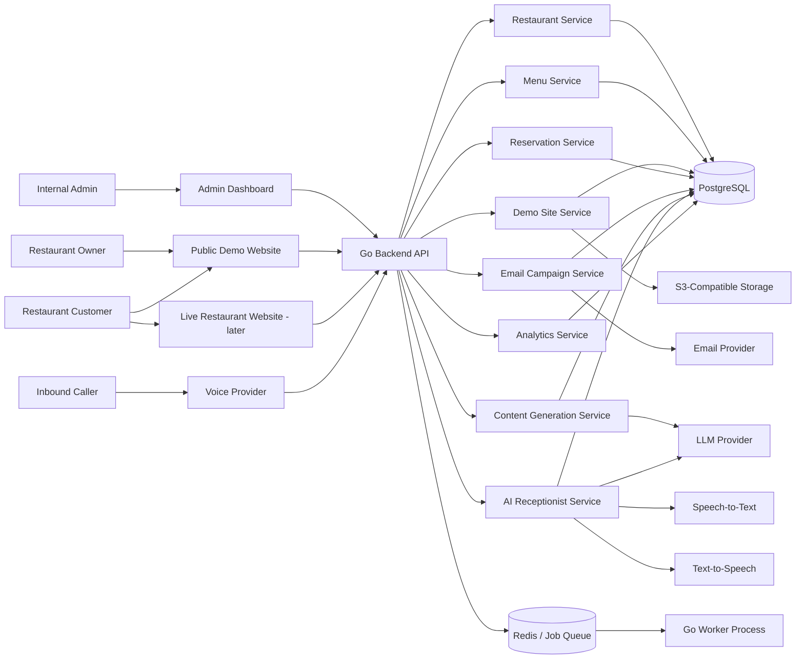
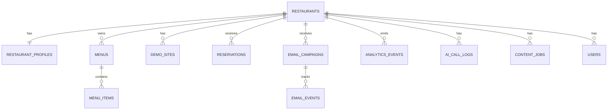
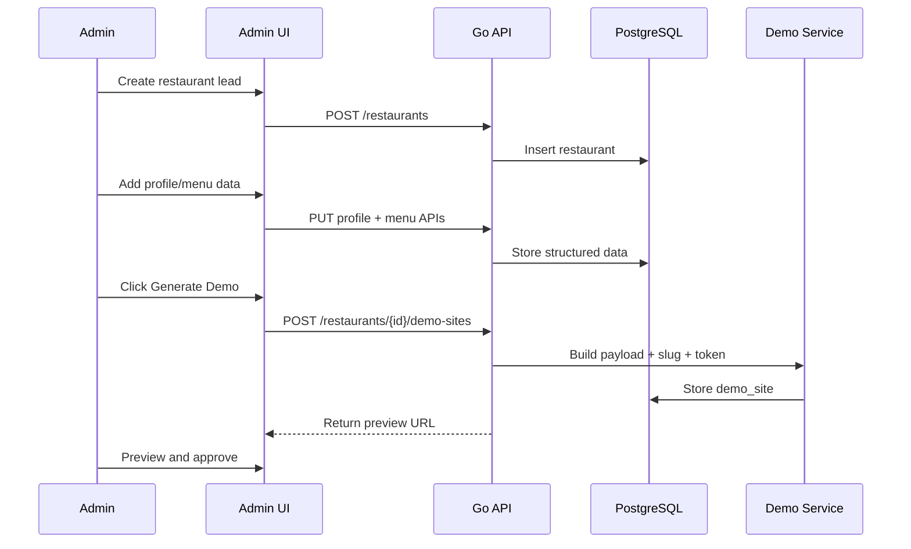
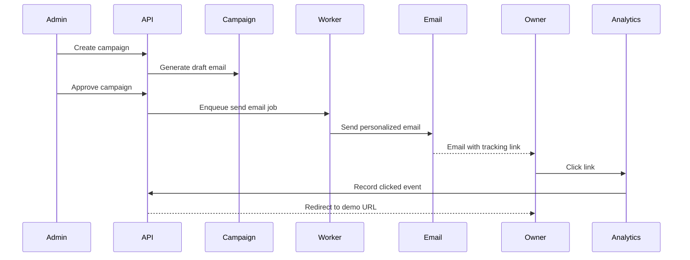
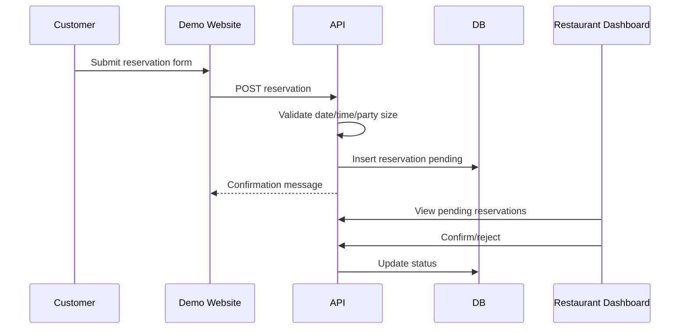
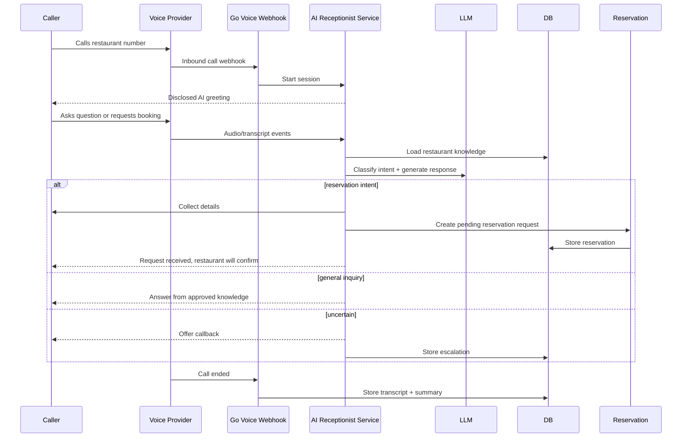
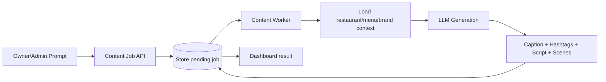

# Phase 1 Implementation Guide — Restaurant Sales MVP

**Audience:** coding agents and developers implementing the first production-ready MVP.  
**Primary backend language:** Go.  
**Primary goal:** build a sales-ready restaurant software platform that can generate personalized restaurant demo websites, send tracked outreach, capture reservation requests, demonstrate an inbound AI receptionist, and generate basic marketing content.

This document intentionally compresses the Phase 1 product, architecture, API, data, GTM, AI, risk, QA, and runbook docs into one implementation-focused guide. Use `PHASE1_TECHNICAL_BACKLOG.md` for ticket-by-ticket execution.

---

## 1. Product Intent

Phase 1 is not a full restaurant SaaS. It is a **sales MVP** for a two-developer team. The product should help the company sell restaurant software packages by showing restaurant owners a personalized working demo before they buy.

The MVP should prove this flow:

1. Internal admin adds a restaurant lead.
2. Admin enters or imports public restaurant details such as name, cuisine, menu, hours, address, and phone.
3. System generates a personalized demo website.
4. System sends a personalized email containing a safe demo link.
5. Restaurant owner opens the demo, views a realistic site, and interacts with reservation or service CTAs.
6. Reservations submitted from the demo are stored and visible in a dashboard.
7. An inbound AI receptionist prototype can answer basic restaurant questions and create reservation requests.
8. A simple content automation feature can generate captions and short video scripts from one prompt.

### Recommended Phase 1 positioning

Sell outcomes, not generic software:

- “Stop losing calls during rush hours.”
- “Turn missed calls into reservation requests.”
- “Get a modern restaurant website without managing tech.”
- “See a personalized website demo before you commit.”
- “Generate weekly social captions and video scripts from one prompt.”

---

## 2. Hard Product Decisions

These decisions should be treated as defaults unless the human team overrides them.

| Area | Decision |
|---|---|
| Backend | Use Go for backend APIs, webhooks, workers, provider adapters, and orchestration. |
| Architecture | Start as a modular monolith, not microservices. Use clear internal packages so modules can be split later. |
| Database | PostgreSQL as source of truth. Use JSONB for flexible restaurant/profile/template/config fields. |
| Async jobs | Use Redis-backed workers or a Postgres job table for MVP. Keep a clean job interface so it can migrate to Temporal later. |
| Frontend | Use Next.js/React for admin dashboard, restaurant dashboard, and public demo pages. Static template rendering is acceptable where faster. |
| Demo links | Use slug + random opaque bearer token or server-side demo ID. Do **not** place the full restaurant payload in the URL. |
| Outreach | Human review before sending early campaigns. Include opt-out language. Track clicks and views. |
| AI receptionist | Inbound-only for Phase 1. It must disclose that it is an AI assistant. Use bounded knowledge and fallback behavior. |
| Reservations | Start with “reservation request,” not real-time table availability. Restaurant confirms/rejects manually. |
| Content automation | Generate script, caption, hashtags, and scene ideas first. Do not build full video rendering in Phase 1. |
| Multi-tenancy | Use `restaurant_id` / `tenant_id` from day one. Enforce access checks in API handlers. |
| Autonomy | AI can assist, draft, summarize, and classify. It should not send outreach, deploy code, or change critical data without a human-controlled trigger in Phase 1. |

---

## 3. Non-Goals for Phase 1

Do not build these unless explicitly requested:

- POS integrations.
- Full table/floor management.
- Native iOS/Android apps.
- Loyalty program.
- Payment processing.
- Full auto-generated videos.
- Auto-posting to social media.
- Outbound AI calling.
- Complex CRM.
- Multi-location enterprise controls.
- Fully autonomous developer/deployment agents. That belongs to Phase 2.

---

## 4. High-Level System Architecture



### Architecture style

Use a **Go modular monolith**:

- One deployable API service.
- One deployable worker service.
- Shared internal packages.
- Provider adapters behind interfaces.
- Domain packages own business rules.
- Database migrations live with backend.

This reduces operational complexity while keeping boundaries clean.

---

## 5. Recommended Repository Structure

```text
repo/
  apps/
    web/                         # Next.js frontend: admin, restaurant dashboard, demo pages
  backend/
    cmd/
      api/                       # Go HTTP API entrypoint
      worker/                    # Go async worker entrypoint
      migrate/                   # optional migration runner
    internal/
      app/                       # dependency wiring, config, startup
      http/                      # router, middleware, request/response helpers
      auth/                      # sessions/JWT, roles, password/session logic
      restaurants/               # restaurant domain, service, repository
      menus/                     # menu domain, service, repository
      demos/                     # demo payloads, slugs, token signing, templates
      reservations/              # reservation domain and workflows
      campaigns/                 # email campaigns, follow-ups, events
      analytics/                 # event tracking and funnel metrics
      ai/
        receptionist/            # voice AI orchestration
        content/                 # content generation service
        prompts/                 # prompt templates and schemas
      providers/
        email/                   # SendGrid/Postmark/Resend/etc adapter
        voice/                   # Twilio/Vapi/Retell/etc adapter
        llm/                     # OpenAI/Anthropic/etc adapter
        storage/                 # S3 adapter
      jobs/                      # queue abstraction and job handlers
      platform/
        db/                      # pgx/sqlc/ent database wiring
        logger/                  # structured logs
        config/                  # env config
        errors/                  # error types
        telemetry/               # metrics/tracing hooks
    migrations/
    tests/
  docs/
    phase1/
      PHASE1_IMPLEMENTATION_GUIDE.md
      PHASE1_TECHNICAL_BACKLOG.md
    phase2/
      PHASE2_IMPLEMENTATION_GUIDE.md
      PHASE2_TECHNICAL_BACKLOG.md
```

### Go implementation defaults

Recommended libraries are defaults, not hard rules:

- HTTP: `chi`, `gin`, `fiber`, or standard `net/http`. Prefer simple middleware and typed handlers.
- DB: `pgx` plus `sqlc`, or `ent` if the team prefers schema-driven ORM. Prefer explicit SQL for critical flows.
- Migrations: `goose`, `atlas`, or `golang-migrate`.
- Jobs: Redis + `asynq`, or a Postgres-backed job table if avoiding Redis initially.
- Logging: `slog` or `zap` with structured fields.
- Validation: explicit request validation at handler/service boundary.
- Config: environment variables parsed into a typed config struct.

---

## 6. Domain Modules

### 6.1 Restaurants

Stores lead/client core identity and lifecycle state.

Status values:

- `lead`
- `demo_ready`
- `emailed`
- `interested`
- `client_onboarding`
- `active_client`
- `lost`
- `archived`

### 6.2 Restaurant Profiles

Stores flexible business details used by the demo site, AI receptionist, and content generator.

Includes:

- Description.
- Cuisine type.
- Hours.
- Address and location details.
- Reservation policy.
- Parking information.
- Dietary options.
- Brand tone.
- Public source notes.
- Review status.

### 6.3 Menus and Menu Items

Used in demo websites and AI responses.

Minimum fields:

- Menu name.
- Item name.
- Category.
- Description.
- Price.
- Image URL.
- Availability flag.

### 6.4 Demo Sites

A demo site is a server-side record that renders a public website from a stable payload.

Important fields:

- Restaurant ID.
- Slug.
- Opaque access-token hash or public token metadata.
- Template ID.
- Payload JSON.
- Status.
- Published URL.
- Expiration date, optional.

Do not put the full restaurant payload into query parameters. Query links should look like:

```text
https://demo.yourdomain.com/?slug=thairama&token=<opaque-token>&template=1
```

### 6.5 Reservations

Use a request-based model.

Status values:

- `pending`
- `confirmed`
- `rejected`
- `cancelled`
- `needs_callback`

### 6.6 Campaigns and Email Events

Campaign flow:

1. Draft campaign generated.
2. Human reviews/approves.
3. Email 1 sent.
4. Clicks/views tracked.
5. Follow-up email scheduled if no response.
6. Campaign stops if lead replies, unsubscribes, or is manually closed.

### 6.7 AI Receptionist

Bounded inbound voice assistant for one restaurant at a time.

Allowed tasks:

- Introduce itself as an AI assistant.
- Answer hours/location/menu/reservation-policy questions.
- Take a reservation request.
- Capture callback request.
- Escalate when uncertain.
- Create a call log with transcript and summary.

Not allowed in Phase 1:

- Pretending to be human.
- Making unsupported claims.
- Confirming table availability unless the restaurant dashboard has explicit availability data.
- Outbound calling.
- Taking payment details.
- Handling emergencies or sensitive medical/legal questions.

### 6.8 Content Automation

MVP output:

- Social caption.
- Hashtags.
- 15–30 second short video script.
- Scene ideas.
- CTA.

No full video rendering in Phase 1.

---

## 7. Minimum Data Model

The exact SQL can evolve, but keep these entities and relationships.



Recommended tables:

```sql
restaurants (
  id uuid primary key,
  name text not null,
  cuisine_type text,
  phone text,
  email text,
  address text,
  website_url text,
  status text not null,
  lead_score int default 0,
  created_at timestamptz not null,
  updated_at timestamptz not null
);

restaurant_profiles (
  id uuid primary key,
  restaurant_id uuid references restaurants(id),
  description text,
  opening_hours jsonb,
  parking_info text,
  dietary_options jsonb,
  reservation_policy text,
  brand_tone text,
  raw_public_data jsonb,
  review_status text not null default 'draft',
  created_at timestamptz not null,
  updated_at timestamptz not null
);

menus (
  id uuid primary key,
  restaurant_id uuid references restaurants(id),
  name text not null,
  status text not null default 'active',
  created_at timestamptz not null,
  updated_at timestamptz not null
);

menu_items (
  id uuid primary key,
  menu_id uuid references menus(id),
  name text not null,
  description text,
  price numeric(10,2),
  category text,
  image_url text,
  is_available boolean default true,
  created_at timestamptz not null,
  updated_at timestamptz not null
);

demo_sites (
  id uuid primary key,
  restaurant_id uuid references restaurants(id),
  slug text unique not null,
  template_id text not null,
  published_url text,
  payload jsonb not null,
  status text not null default 'draft',
  token_hash text,
  expires_at timestamptz,
  created_at timestamptz not null,
  updated_at timestamptz not null
);

reservations (
  id uuid primary key,
  restaurant_id uuid references restaurants(id),
  source text not null, -- demo_site, live_site, ai_call, admin
  customer_name text not null,
  customer_phone text not null,
  customer_email text,
  reservation_date date not null,
  reservation_time time not null,
  party_size int not null,
  notes text,
  status text not null default 'pending',
  created_at timestamptz not null,
  updated_at timestamptz not null
);

email_campaigns (
  id uuid primary key,
  restaurant_id uuid references restaurants(id),
  campaign_type text not null,
  status text not null,
  current_step int default 0,
  last_sent_at timestamptz,
  stopped_reason text,
  created_at timestamptz not null,
  updated_at timestamptz not null
);

email_events (
  id uuid primary key,
  campaign_id uuid references email_campaigns(id),
  restaurant_id uuid references restaurants(id),
  event_type text not null, -- sent, opened, clicked, bounced, unsubscribed, replied
  metadata jsonb,
  event_time timestamptz not null
);

analytics_events (
  id uuid primary key,
  restaurant_id uuid references restaurants(id),
  demo_site_id uuid references demo_sites(id),
  event_type text not null,
  anonymous_id text,
  metadata jsonb,
  event_time timestamptz not null
);

ai_call_logs (
  id uuid primary key,
  restaurant_id uuid references restaurants(id),
  provider_call_id text,
  caller_phone text,
  transcript text,
  summary text,
  intent text,
  reservation_id uuid references reservations(id),
  escalation_required boolean default false,
  metadata jsonb,
  created_at timestamptz not null
);

content_jobs (
  id uuid primary key,
  restaurant_id uuid references restaurants(id),
  prompt text not null,
  status text not null default 'pending',
  output_caption text,
  output_hashtags jsonb,
  output_script text,
  output_scene_ideas jsonb,
  output_assets jsonb,
  error_message text,
  created_at timestamptz not null,
  updated_at timestamptz not null
);
```

---

## 8. API Surface

Prefix all APIs with `/api/v1`.

This section is the Phase 1 target inventory. The current implemented contract
is `docs/openapi/openapi.yaml` together with `backend/internal/http/router.go`;
routes listed here but absent there remain planned rather than operational.

### Auth

```http
POST /api/v1/auth/login
POST /api/v1/auth/logout
GET  /api/v1/auth/me
```

### Restaurants

```http
POST   /api/v1/restaurants
GET    /api/v1/restaurants
GET    /api/v1/restaurants/{restaurant_id}
PATCH  /api/v1/restaurants/{restaurant_id}
DELETE /api/v1/restaurants/{restaurant_id}
PATCH  /api/v1/restaurants/{restaurant_id}/status
```

### Profiles

```http
GET   /api/v1/restaurants/{restaurant_id}/profile/review-preview
PATCH /api/v1/restaurants/{restaurant_id}/profile/review
```

### Scrape Jobs

```http
POST /api/v1/scrape-jobs
GET  /api/v1/scrape-jobs
GET  /api/v1/scrape-jobs/{scrape_job_id}
```

### Menus

```http
POST   /api/v1/restaurants/{restaurant_id}/menus
GET    /api/v1/restaurants/{restaurant_id}/menus
POST   /api/v1/menus/{menu_id}/items
PATCH  /api/v1/menu-items/{item_id}
DELETE /api/v1/menu-items/{item_id}
```

### Demo Sites

```http
POST /api/v1/restaurants/{restaurant_id}/demo-sites
GET /api/v1/demo-sites/{demo_site_id}/review-preview
PATCH /api/v1/demo-sites/{demo_site_id}/status
POST /api/v1/campaigns/{campaign_id}/regenerate
```

Public route:

```http
GET /api/public/v1/demo/{slug}?token={opaque_token}
```

### Reservations

```http
GET /api/public/v1/restaurants/{restaurant_id}/table-availability
PUT /api/public/v1/restaurants/{restaurant_id}/reservations
```

### Email Campaigns

```http
POST /api/v1/restaurants/{restaurant_id}/campaigns
GET  /api/v1/restaurants/{restaurant_id}/campaigns
POST /api/v1/campaigns/{campaign_id}/approve
POST /api/v1/campaigns/{campaign_id}/regenerate
POST /api/v1/campaigns/{campaign_id}/stop
GET  /api/v1/campaigns/{campaign_id}
POST /api/v1/outreach/bulk-send
GET  /api/v1/outreach/bulk-send/status
```

Outreach delivery is available only through the quota-managed bulk workflow.
The former per-campaign `send-step` route is intentionally not registered.

Tracking routes:

```http
GET /t/click/{tracking_token}
GET /t/open/{tracking_token}
GET /t/unsubscribe/{tracking_token}
```

### Voice / AI Receptionist

```http
POST /api/v1/voice/inbound
POST /api/v1/voice/events
POST /api/v1/voice/call-ended
GET  /api/v1/restaurants/{restaurant_id}/call-logs
GET  /api/v1/call-logs/{call_log_id}
```

### Content Jobs

```http
POST /api/v1/restaurants/{restaurant_id}/content-jobs
GET  /api/v1/restaurants/{restaurant_id}/content-jobs
GET  /api/v1/content-jobs/{content_job_id}
POST /api/v1/content-jobs/{content_job_id}/regenerate
```

### Analytics

```http
GET /api/v1/restaurants/{restaurant_id}/analytics/summary
GET /api/v1/restaurants/{restaurant_id}/analytics/events
```

---

## 9. Critical Workflows

### 9.1 Lead to personalized demo



Implementation notes:

- `DemoService.BuildPayload(restaurantID)` should read restaurant, profile, menu, selected template, and default brand rules.
- Store payload snapshot in `demo_sites.payload` so the demo remains stable even if the restaurant profile changes later.
- Add a regenerate action when admins want to refresh the demo from latest data.
- Add a `review_status` field so unreviewed AI/imported data is not accidentally emailed.

### 9.2 Outreach email with tracking



Implementation notes:

- Do not send automatically after lead creation.
- Store email copy for audit/debugging.
- Include opt-out/unsubscribe text.
- Stop follow-ups if unsubscribed/replied/closed.
- Use tracking tokens that map to campaign/restaurant/demo records.

### 9.3 Reservation request



Rules:

- Default to `pending`.
- Do not promise confirmed reservation until owner confirms.
- If source is `ai_call`, link `ai_call_logs.reservation_id`.

### 9.4 AI receptionist inbound call



Prompt requirements:

- Start with disclosure: “I’m the AI assistant for [restaurant].”
- Use only provided restaurant knowledge.
- Ask clarifying questions for missing reservation details.
- Never state that a reservation is confirmed unless explicit confirmation logic exists.
- Escalate when uncertain.

### 9.5 Content automation MVP



Rules:

- Output should be editable and copyable.
- Save prompt and generated output.
- Avoid unsupported claims like “best in town” unless the user provides it as brand copy.
- No automatic posting in Phase 1.

---

## 10. Provider Adapter Interfaces

Provider calls must sit behind interfaces so vendor changes are cheap.

Example Go-style interfaces:

```go
type EmailProvider interface {
    Send(ctx context.Context, req SendEmailRequest) (SendEmailResult, error)
}

type LLMProvider interface {
    Generate(ctx context.Context, req GenerateRequest) (GenerateResult, error)
    GenerateJSON(ctx context.Context, req GenerateJSONRequest, out any) error
}

type VoiceProvider interface {
    BuildInboundResponse(ctx context.Context, req VoiceResponseRequest) (VoiceResponse, error)
    ValidateWebhook(r *http.Request) error
}

type ObjectStore interface {
    Put(ctx context.Context, key string, body io.Reader, opts PutOptions) (ObjectRef, error)
    SignedURL(ctx context.Context, key string, ttl time.Duration) (string, error)
}
```

Do not import provider SDKs directly into domain services. Provider-specific code belongs under `internal/providers/*`.

---

## 11. Analytics Event Taxonomy

Track these events at minimum:

| Event | Source | Purpose |
|---|---|---|
| `lead.created` | admin | Lead volume. |
| `profile.reviewed` | admin | Human review gate. |
| `demo.generated` | backend | Demo generation count. |
| `demo.viewed` | public demo | Owner engagement. |
| `demo.cta_clicked` | public demo | Interest intent. |
| `email.sent` | campaign worker | Campaign audit. |
| `email.clicked` | tracking route | Outreach engagement. |
| `email.unsubscribed` | tracking route | Compliance. |
| `reservation.created` | demo/site/AI | Revenue proxy. |
| `reservation.status_changed` | dashboard | Operational usage. |
| `ai_call.started` | voice webhook | AI usage. |
| `ai_call.ended` | voice webhook | AI usage. |
| `ai_call.escalated` | receptionist | Quality/safety tracking. |
| `content_job.created` | dashboard | Content feature usage. |
| `content_job.completed` | worker | AI generation success. |

Event writes should never block user-facing flows. Use fire-and-forget or queue where possible.

---

## 12. Security and Compliance Guardrails

This guide is not legal advice, but the implementation must support safer operation.

### Email outreach

- Include opt-out/unsubscribe language.
- Maintain suppression list.
- Stop sequences on unsubscribe/reply/manual close.
- Avoid misleading subject lines.
- Store campaign events.

### Demo data

- Use only approved/public/manual data.
- Do not expose internal notes on public demo pages.
- Use token-gated demo links with per-demo random opaque tokens.
- Allow token rotation/expiry.

### AI receptionist

- Inbound-only in Phase 1.
- Disclose AI identity.
- Avoid recording calls unless consent/legal requirements are handled.
- Store only required call details.
- Provide escalation path.
- Do not handle payments or sensitive personal data.

### Authentication and authorization

- Admin dashboard requires auth.
- Restaurant dashboard requires auth.
- Public demo routes expose only public-safe payload data.
- Every restaurant-scoped API must check user access to `restaurant_id`.

---

## 13. Environment Variables

Use typed config validation at startup.

```text
APP_ENV=local|staging|production
APP_BASE_URL=https://app.example.com
DEMO_BASE_URL=https://demo.example.com
API_PORT=8080
DATABASE_URL=postgres://...
REDIS_URL=redis://...
JWT_SECRET=...
DEMO_TOKEN_TTL=720h
EMAIL_PROVIDER=...
EMAIL_API_KEY=...
EMAIL_FROM=...
LLM_PROVIDER=...
LLM_API_KEY=...
VOICE_PROVIDER=...
VOICE_WEBHOOK_SECRET=...
STORAGE_PROVIDER=s3
S3_BUCKET=...
S3_REGION=...
S3_ACCESS_KEY_ID=...
S3_SECRET_ACCESS_KEY=...
LOG_LEVEL=info
```

Never commit secrets.

---

## 14. Testing Strategy

### Backend tests

- Unit tests for services: demo payload, token signing, reservation validation, campaign state transitions.
- Repository tests using test database or transaction rollback.
- Handler tests for validation and auth.
- Provider adapter tests with mocked provider clients.
- Job handler tests for idempotency.

### Frontend tests

- Basic component tests for forms.
- E2E happy path: create lead → generate demo → submit reservation.
- Mobile responsiveness checks for public demo pages.

### AI tests

- Golden prompt tests for content outputs.
- Roleplay tests for AI receptionist intents:
  - hours inquiry
  - menu inquiry
  - reservation request
  - unavailable/unknown question
  - callback escalation
- Confirm AI never says it is human.
- Confirm reservation requests are pending, not confirmed.

### Release gates

A Phase 1 release is shippable when:

- DB migrations run cleanly.
- API health check passes.
- Admin can create a lead.
- Admin can generate and preview demo.
- Demo link loads publicly.
- Reservation form stores data.
- Dashboard shows reservation.
- Campaign email can be sent in staging.
- Tracking link records click.
- AI receptionist test call works for one restaurant.
- Content job generates caption/script.
- Basic logs exist for errors.

---

## 15. Implementation Order

Build in this order to maximize sales value:

1. Go backend foundation, migrations, config, auth shell.
2. Restaurant/profile/menu CRUD.
3. Demo payload builder and token-gated demo route.
4. First polished restaurant demo template.
5. Reservation API and form.
6. Admin dashboard lead/demo management.
7. Email campaign draft/send/track flow.
8. Analytics event model and funnel summary.
9. Restaurant dashboard for reservations.
10. AI receptionist prototype for one restaurant.
11. Content generation MVP.
12. Staging deployment and release runbook.

Do not start AI receptionist before demo generation and reservation capture are working, unless specifically assigned.

---

## 16. Definition of Done

A feature is done when:

- API and/or UI is implemented.
- Input validation exists.
- Auth/access control is enforced where needed.
- Errors return safe messages.
- Logs include useful context without leaking secrets.
- Tests cover happy path and major failure paths.
- DB migrations are included.
- Feature works locally and in staging.
- Relevant events are tracked.
- Documentation or comments are updated if behavior is non-obvious.
- Acceptance criteria in backlog are satisfied.

---

## 17. Open Questions for Humans

The coding agent should proceed with defaults unless these are answered differently:

1. Which frontend stack is final: Next.js, React SPA, or server-rendered Go templates?
2. Which email provider should be used first?
3. Which voice provider should be used first?
4. Should calls be recorded, or should Phase 1 store transcript/summary only?
5. Which hosting target is preferred: VPS/Docker, managed app platform, or Kubernetes?
6. Should restaurant owners get login accounts in Phase 1, or should admin-only views be enough for first demos?
7. Should demo sites be public indefinitely or expire after a fixed number of days?
