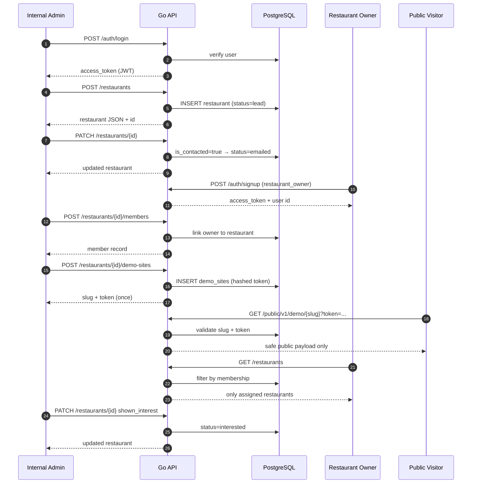
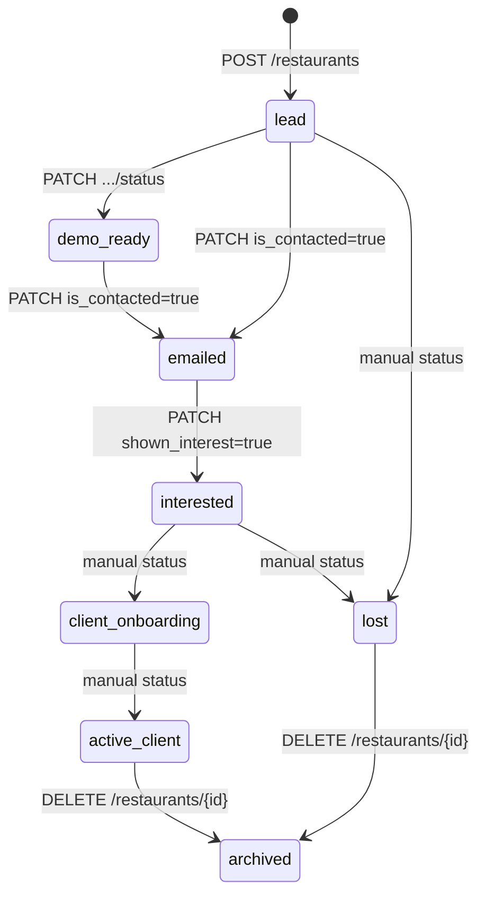

# Phase 1 API Architecture & JSON Contracts

**Date:** 23 June 2026  
**Purpose:** Excalidraw / PM demo reference — system boxes, request flow, and **exact JSON** per endpoint.  
**Base URL:** `http://localhost:8080`  
**Postman flow:** `postman/` → folder `01 — PM Demo Flow (in order)`

---

## 1. High-level architecture (draw in Excalidraw)

Use this layout: **3 actors on top**, **API in middle**, **PostgreSQL at bottom**.

```mermaid
flowchart TB
    subgraph Actors
        A[Internal Admin<br/>role: internal_admin]
        O[Restaurant Owner<br/>role: restaurant_owner]
        P[Public Visitor<br/>no login]
        D[Developer<br/>role: developer]
    end

    subgraph API["Go API :8080"]
        AUTH[Auth<br/>/api/v1/auth/*]
        ADM[Admin<br/>/api/v1/admin/*]
        REST[Restaurants<br/>/api/v1/restaurants/*]
        DEMO[Demo Sites<br/>.../demo-sites]
        PUB[Public Demo<br/>/api/public/v1/demo/{slug}]
        HLTH[Health<br/>/healthz /readyz]
    end

    subgraph Data
        DB[(PostgreSQL)]
    end

    A -->|Bearer JWT| AUTH
    A -->|Bearer JWT| ADM
    A -->|Bearer JWT| REST
    A -->|Bearer JWT| DEMO
    O -->|Bearer JWT| AUTH
    O -->|Bearer JWT| REST
    P -->|slug + token query| PUB
    D -->|Bearer JWT| HLTH

    AUTH --> DB
    ADM --> DB
    REST --> DB
    DEMO --> DB
    PUB --> DB
    HLTH --> DB
```

### Excalidraw box colors (suggested)

| Box | Color | Label |
|-----|-------|-------|
| Actors | Blue | Admin, Owner, Public, Developer |
| Auth / Admin | Purple | JWT endpoints |
| Restaurants / Demo | Green | Sales MVP core |
| Public Demo | Orange | No auth — customer link |
| PostgreSQL | Gray | `users`, `restaurants`, `restaurant_members`, `demo_sites` |

---

## 2. PM demo sequence (numbered arrows)

Draw **left → right** or **top → bottom** with step numbers matching Postman folder `01`.



---

## 3. Auth & roles matrix

| Role | Value | Signup? | Can do |
|------|-------|---------|--------|
| Internal admin | `internal_admin` | No (`make seed-admin`) | Create restaurants, demo sites, members, PATCH, archive |
| Restaurant owner | `restaurant_owner` | Yes | List/get **assigned** restaurants only |
| Developer | `developer` | Yes (local only) | `/healthz`, `/readyz` |

**All protected routes:** `Authorization: Bearer <access_token>`

**Error shape (all endpoints):**

```json
{
  "error": {
    "code": "invalid_credentials",
    "message": "Invalid credentials."
  }
}
```

---

## 4. Endpoint catalog — request & response JSON

### 4.1 Auth (public)

#### `POST /api/v1/auth/signup`

| | |
|---|---|
| **Auth** | None |
| **Allowed roles** | `restaurant_owner`, `developer` (local env) |
| **Status** | `201` success · `403` forbidden role · `409` email exists |

**Request:**

```json
{
  "email": "owner@local.test",
  "password": "password123",
  "full_name": "Demo Restaurant Owner",
  "role": "restaurant_owner"
}
```

**Response `201`:**

```json
{
  "access_token": "eyJhbGciOiJIUzI1NiIs...",
  "token_type": "Bearer",
  "expires_in": 3600,
  "user": {
    "id": "a1b2c3d4-e5f6-7890-abcd-ef1234567890",
    "email": "owner@local.test",
    "full_name": "Demo Restaurant Owner",
    "role": "restaurant_owner"
  }
}
```

---

#### `POST /api/v1/auth/login`

| | |
|---|---|
| **Auth** | None |
| **Status** | `200` · `401` invalid credentials |

**Request:**

```json
{
  "email": "admin@local.test",
  "password": "password123"
}
```

**Response `200`:** (same shape as signup `201`)

```json
{
  "access_token": "eyJhbGciOiJIUzI1NiIs...",
  "token_type": "Bearer",
  "expires_in": 3600,
  "user": {
    "id": "b2c3d4e5-f6a7-8901-bcde-f12345678901",
    "email": "admin@local.test",
    "full_name": "Local Admin",
    "role": "internal_admin"
  }
}
```

---

#### `GET /api/v1/auth/me`

| | |
|---|---|
| **Auth** | Bearer — any logged-in user |
| **Status** | `200` · `401` |

**Response `200`:**

```json
{
  "user_id": "a1b2c3d4-e5f6-7890-abcd-ef1234567890",
  "email": "owner@local.test",
  "role": "restaurant_owner"
}
```

---

### 4.2 Admin

#### `GET /api/v1/admin/me`

| | |
|---|---|
| **Auth** | Bearer — `internal_admin` only |
| **Status** | `200` · `401` · `403` |

**Response `200`:**

```json
{
  "id": "b2c3d4e5-f6a7-8901-bcde-f12345678901",
  "email": "admin@local.test",
  "full_name": "Local Admin",
  "role": "internal_admin"
}
```

---

### 4.3 Restaurants

#### `GET /api/v1/restaurants`

| | |
|---|---|
| **Auth** | Bearer — `internal_admin` (all) or `restaurant_owner` (scoped) |
| **Query** | `?restaurant=thai` · `?status=lead` · `?is_contacted=true` · `?shown_interest=false` · `?include_archived=true` |
| **Status** | `200` · `400` bad filter · `401` · `403` |

**Response `200`:**

```json
{
  "items": [
    {
      "id": "c3d4e5f6-a7b8-9012-cdef-123456789012",
      "name": "PM Demo Thai Kitchen",
      "email": "lead@pmdemo.test",
      "status": "lead",
      "is_contacted": false,
      "shown_interest": false,
      "created_at": "2026-06-23T10:00:00Z",
      "updated_at": "2026-06-23T10:00:00Z"
    }
  ]
}
```

---

#### `POST /api/v1/restaurants`

| | |
|---|---|
| **Auth** | Bearer — `internal_admin` only |
| **Status** | `201` · `400` · `401` · `403` |

**Request:**

```json
{
  "name": "PM Demo Thai Kitchen",
  "email": "lead@pmdemo.test"
}
```

**Response `201`:**

```json
{
  "id": "c3d4e5f6-a7b8-9012-cdef-123456789012",
  "name": "PM Demo Thai Kitchen",
  "email": "lead@pmdemo.test",
  "status": "lead",
  "is_contacted": false,
  "shown_interest": false,
  "created_at": "2026-06-23T10:00:00Z",
  "updated_at": "2026-06-23T10:00:00Z"
}
```

---

#### `GET /api/v1/restaurants/{id}`

| | |
|---|---|
| **Auth** | Bearer — admin or owner with membership |
| **Status** | `200` · `401` · `403` · `404` |

**Response `200`:** (single object — same fields as one item in list)

```json
{
  "id": "c3d4e5f6-a7b8-9012-cdef-123456789012",
  "name": "PM Demo Thai Kitchen",
  "email": "lead@pmdemo.test",
  "status": "emailed",
  "is_contacted": true,
  "shown_interest": false,
  "created_at": "2026-06-23T10:00:00Z",
  "updated_at": "2026-06-23T10:05:00Z"
}
```

---

#### `PATCH /api/v1/restaurants/{id}`

| | |
|---|---|
| **Auth** | Bearer — `internal_admin` only |
| **Status** | `200` · `400` · `401` · `403` · `404` |
| **Auto rules** | `is_contacted: true` → status `emailed` · `shown_interest: true` → status `interested` |

**Request:**

```json
{
  "name": "Updated Thai Kitchen",
  "email": "updated@pmdemo.test",
  "is_contacted": true,
  "shown_interest": false
}
```

**Response `200`:**

```json
{
  "id": "c3d4e5f6-a7b8-9012-cdef-123456789012",
  "name": "Updated Thai Kitchen",
  "email": "updated@pmdemo.test",
  "status": "emailed",
  "is_contacted": true,
  "shown_interest": false,
  "created_at": "2026-06-23T10:00:00Z",
  "updated_at": "2026-06-23T10:10:00Z"
}
```

---

#### `PATCH /api/v1/restaurants/{id}/status`

| | |
|---|---|
| **Auth** | Bearer — `internal_admin` only |
| **Status** | `200` · `400` invalid status · `404` |

**Request:**

```json
{
  "status": "demo_ready"
}
```

**Valid status values:**  
`lead` · `demo_ready` · `emailed` · `interested` · `client_onboarding` · `active_client` · `lost` · `archived`

**Response `200`:** (full restaurant object with new status)

```json
{
  "id": "c3d4e5f6-a7b8-9012-cdef-123456789012",
  "name": "PM Demo Thai Kitchen",
  "email": "lead@pmdemo.test",
  "status": "demo_ready",
  "is_contacted": true,
  "shown_interest": false,
  "created_at": "2026-06-23T10:00:00Z",
  "updated_at": "2026-06-23T10:15:00Z"
}
```

---

#### `DELETE /api/v1/restaurants/{id}`

| | |
|---|---|
| **Auth** | Bearer — `internal_admin` only |
| **Behavior** | Soft archive — sets `status: archived` |
| **Status** | `200` · `401` · `403` · `404` |

**Request body:** none

**Response `200`:**

```json
{
  "id": "c3d4e5f6-a7b8-9012-cdef-123456789012",
  "name": "PM Demo Thai Kitchen",
  "email": "lead@pmdemo.test",
  "status": "archived",
  "is_contacted": true,
  "shown_interest": true,
  "created_at": "2026-06-23T10:00:00Z",
  "updated_at": "2026-06-23T11:00:00Z"
}
```

---

#### `GET /api/v1/restaurants/{id}/members`

| | |
|---|---|
| **Auth** | Bearer — `internal_admin` only |
| **Status** | `200` · `401` · `403` · `404` |

**Response `200`:**

```json
{
  "items": [
    {
      "id": "d4e5f6a7-b8c9-0123-def0-234567890123",
      "restaurant_id": "c3d4e5f6-a7b8-9012-cdef-123456789012",
      "user_id": "a1b2c3d4-e5f6-7890-abcd-ef1234567890",
      "member_role": "owner",
      "created_at": "2026-06-23T10:20:00Z"
    }
  ]
}
```

---

#### `POST /api/v1/restaurants/{id}/members`

| | |
|---|---|
| **Auth** | Bearer — `internal_admin` only |
| **Status** | `201` · `400` · `401` · `403` · `404` |

**Request:**

```json
{
  "user_id": "a1b2c3d4-e5f6-7890-abcd-ef1234567890",
  "member_role": "owner"
}
```

**Response `201`:**

```json
{
  "id": "d4e5f6a7-b8c9-0123-def0-234567890123",
  "restaurant_id": "c3d4e5f6-a7b8-9012-cdef-123456789012",
  "user_id": "a1b2c3d4-e5f6-7890-abcd-ef1234567890",
  "member_role": "owner",
  "created_at": "2026-06-23T10:20:00Z"
}
```

---

### 4.4 Demo sites (admin)

#### `POST /api/v1/restaurants/{id}/demo-sites`

| | |
|---|---|
| **Auth** | Bearer — `internal_admin` only |
| **Status** | `201` · `400` · `401` · `403` · `404` |
| **Important** | `token` returned **only once** — store it for public demo URL |

**Request:**

```json
{
  "slug": "pm-demo-thai-kitchen",
  "status": "published",
  "public_payload": {
    "restaurant_name": "PM Demo Thai Kitchen",
    "cuisine": "Thai",
    "hero": "Welcome — book your table today",
    "hours": { "monday": "11:00-22:00" },
    "address": "123 Demo Street",
    "phone": "+1-555-0100",
    "menu_sections": [
      { "name": "Mains", "items": ["Pad Thai", "Green Curry"] }
    ],
    "reservation_cta": "Book a table",
    "ai_receptionist_cta": "Call our AI assistant"
  }
}
```

**Response `201`:**

```json
{
  "id": "e5f6a7b8-c9d0-1234-ef01-345678901234",
  "slug": "pm-demo-thai-kitchen",
  "token": "xK9mP2nQ7rS4tU8vW1yZ3aB5cD6eF0gH",
  "status": "published"
}
```

**Email link format (for diagram arrow label):**

```text
GET /api/public/v1/demo/pm-demo-thai-kitchen?token=xK9mP2nQ7rS4tU8vW1yZ3aB5cD6eF0gH
```

---

### 4.5 Public demo (no auth)

#### `GET /api/public/v1/demo/{slug}?token={token}`

| | |
|---|---|
| **Auth** | None |
| **Status** | `200` · `404` demo_not_found |
| **Security** | Strips `lead_notes`, `raw_enrichment`, internal fields |

**Response `200`:**

```json
{
  "restaurant_name": "PM Demo Thai Kitchen",
  "cuisine": "Thai",
  "hero": "Welcome — book your table today",
  "hours": { "monday": "11:00-22:00" },
  "address": "123 Demo Street",
  "phone": "+1-555-0100",
  "menu_sections": [
    { "name": "Mains", "items": ["Pad Thai", "Green Curry"] }
  ],
  "reservation_cta": "Book a table",
  "ai_receptionist_cta": "Call our AI assistant"
}
```

**Response `404`:**

```json
{
  "error": {
    "code": "demo_not_found",
    "message": "Demo site was not found."
  }
}
```

---

### 4.6 Health (developer JWT)

#### `GET /healthz`

| | |
|---|---|
| **Auth** | Bearer — `developer` role |
| **Status** | `200` · `401` |

**Response `200`:**

```json
{
  "status": "ok",
  "service": "restaurant-platform-api",
  "env": "local",
  "version": "0.1.0"
}
```

---

#### `GET /readyz`

| | |
|---|---|
| **Auth** | Bearer — `developer` role |
| **Status** | `200` · `503` database not ready |

**Response `200`:**

```json
{
  "status": "ok",
  "database": "ready"
}
```

---

## 5. Restaurant lifecycle (status state machine)

Draw as a horizontal arrow diagram in Excalidraw:



---

## 6. Excalidraw canvas layout (copy this structure)

```
┌─────────────────────────────────────────────────────────────────────────────┐
│  ACTORS (top row)                                                           │
│  [Internal Admin]   [Restaurant Owner]   [Public Visitor]   [Developer]     │
└────────┬──────────────────┬────────────────────┬─────────────────┬──────────┘
         │ JWT              │ JWT                │ slug+token      │ JWT
         ▼                  ▼                    ▼                 ▼
┌─────────────────────────────────────────────────────────────────────────────┐
│  GO API :8080                                                               │
│  ┌──────────┐ ┌──────────┐ ┌─────────────────────┐ ┌──────────────────┐  │
│  │ Auth     │ │ Admin    │ │ Restaurants         │ │ Public Demo      │  │
│  │ signup   │ │ /admin/me│ │ CRUD + filters      │ │ GET /public/...  │  │
│  │ login    │ │          │ │ members + demo-sites│ │ (no JWT)         │  │
│  │ /auth/me │ │          │ │                     │ │                  │  │
│  └──────────┘ └──────────┘ └─────────────────────┘ └──────────────────┘  │
│  ┌──────────┐                                                               │
│  │ Health   │  /healthz  /readyz  (developer only)                          │
│  └──────────┘                                                               │
└────────────────────────────────┬────────────────────────────────────────────┘
                                 │
                                 ▼
                    ┌────────────────────────┐
                    │ PostgreSQL             │
                    │ users                  │
                    │ restaurants            │
                    │ restaurant_members     │
                    │ demo_sites             │
                    └────────────────────────┘
```

### PM flow arrows (annotate on canvas)

| # | From | To | Label on arrow |
|---|------|-----|----------------|
| 1 | Admin | `POST /auth/login` | Request JSON §4.1 |
| 2 | Admin | `POST /restaurants` | Create lead §4.3 |
| 3 | Admin | `PATCH /restaurants/{id}` | `is_contacted: true` |
| 4 | Admin | `POST .../demo-sites` | Returns slug + token |
| 5 | Public | `GET /public/v1/demo/{slug}` | Safe payload §4.5 |
| 6 | Owner | `GET /restaurants` | Scoped list only |

Paste **response JSON snippets** from Section 4 next to each arrow in Excalidraw text boxes.

---

## 7. Database tables (bottom layer boxes)

| Table | Key columns |
|-------|-------------|
| `users` | id, email, password_hash, role, is_active |
| `restaurants` | id, name, email, status, is_contacted, shown_interest |
| `restaurant_members` | restaurant_id, user_id, member_role |
| `demo_sites` | restaurant_id, slug, token_hash, status, public_payload, expires_at |

---

## 8. Quick test commands

```bash
make db-up && make migrate-up && make seed-admin && make api
```

Import Postman: `postman/Restaurant-Platform.postman_collection.json`  
Run folder: **01 — PM Demo Flow (in order)**

---

## 9. What is NOT in Phase 1 yet (draw as dashed boxes)

- `restaurant_profiles` (P1-011)
- Menu CRUD (P1-013)
- Reservations (P1-021+)
- Email campaigns (P1-028+)
- AI receptionist / content generation

Use **dashed outlines** in Excalidraw for these future modules.
