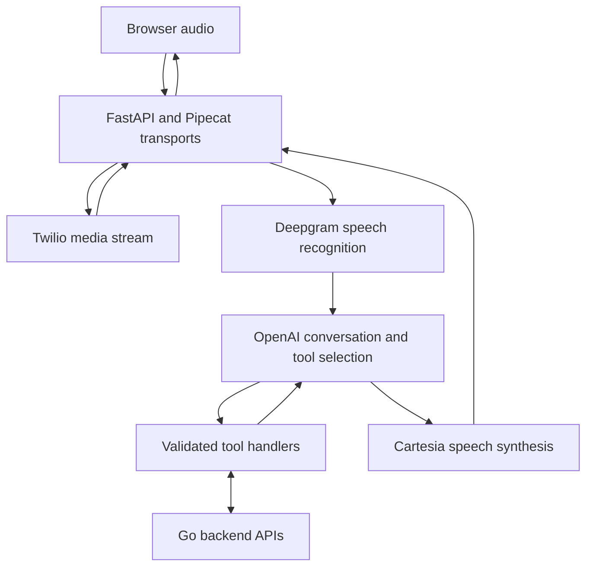

# Real-Time AI Voice Agent

A streaming voice runtime that connects natural conversation to typed backend operations. The engineering problem is coordinating speech recognition, model tool calls, speech synthesis, and interruptions within one interactive session.

## Architecture

Pipecat manages the streaming pipeline, voice activity detection, conversation context, and interruption handling. The browser transport uses PCM audio over WebSocket with separate status/transcript events. Tool handlers connect model-selected operations to backend APIs; this is API-grounded tool calling, with no vector-store retrieval layer required by this flow.

## Engineering decisions

- **Separate conversation from operations:** persona prompts and tool schemas define available actions; API clients perform backend requests.
- **Handle conversational turn-taking:** voice activity detection and interruptible audio keep the interaction responsive when a user speaks over a response.
- **Support two transports:** browser audio and phone media streams share the speech/model pipeline while retaining transport-specific handling.
- **Keep outbound calling gated:** the outbound call entry point remains disabled in the current implementation.

## Start reading

| Source | Responsibility |
| --- | --- |
| [bot.py](bot.py) | FastAPI routes, transports, streaming pipeline, tool dispatch |
| [prompts](prompts/) | Conversation instructions and tool schemas |
| [api_client.py](api_client.py) | Restaurant backend API integration |
| [requirements.txt](requirements.txt) | Runtime dependencies |
| [Architecture and setup guide](voice_sales_agent_architecture_guide.md) | Configuration and development details |
| [Calling guide](CALLING.md) | Telephony behavior and operational constraints |

**Stack:** Python, FastAPI, Pipecat, WebSockets, Deepgram, OpenAI, Cartesia, Twilio, Go APIs. Architecture reflects the checked-in implementation; it does not claim measured latency or production traffic volumes.
