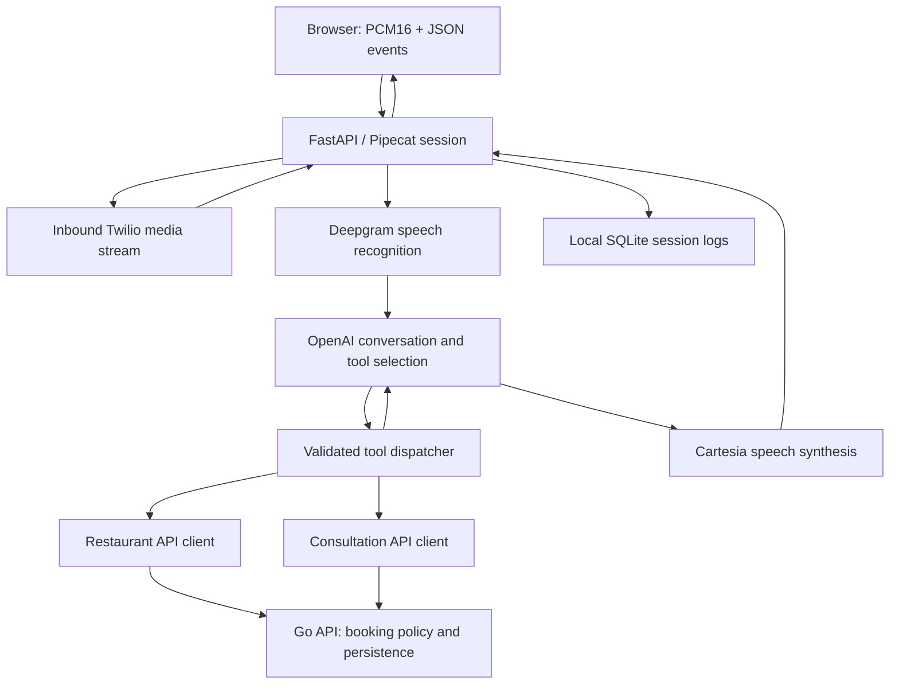

# Real-time voice agent with backend tool calling

A Python/FastAPI service that connects streaming speech to Go backend APIs.
The interesting part is the boundary between conversation and a real operation:
checking a slot, collecting precise details, submitting a request, and reporting
the backend's actual result.

This README describes the checked-in implementation. It is not a production
readiness statement or a latency benchmark. Despite the historical directory
name, the current runtime is **inbound-only**; `POST /call` returns 403.

## Architecture



The browser endpoint `/browser-stream` accepts mono PCM16 at 16 kHz and returns
PCM16 plus JSON status/transcript/booking events. `agent` selects corporate or
restaurant behavior; `restaurant_index` identifies restaurant context. Pipecat
coordinates transcription, context aggregation, model output, speech synthesis,
and interruption handling.

## Engineering decisions to inspect

| Decision | Why it matters | Evidence |
| --- | --- | --- |
| Separate personas and tool sets | Restaurant reservations and corporate consultations have different contracts | [`prompts/`](prompts/) and [`bot.py`](bot.py) |
| Explicit backend adapters | The conversational layer consumes API results rather than owning booking persistence | [`api_client.py`](api_client.py), [`tuvi_api_client.py`](tuvi_api_client.py) |
| Typed browser details for consultation booking | Names/contact details need precision beyond speech transcription | `handle_browser_tool` in [`bot.py`](bot.py) |
| Pending reservation responses | A submitted restaurant request must not be described as a confirmed table | Reservation handling in [`bot.py`](bot.py) |
| Separate browser serializer | Binary audio and JSON control events share one connection | [`browser_serializer.py`](browser_serializer.py) |
| Fail-closed outbound entry point | The historical service name must not imply permission to initiate calls | `initiate_call` and [`tests/test_inbound_only.py`](tests/test_inbound_only.py) |

The browser clients are separate consumers of the voice protocol. See the
[corporate hook](../web/src/hooks/useVoiceAgentSession.ts) and
[restaurant voice configuration](../template/src/lib/voiceAgentConfig.ts).

## Start reading

| Source | Responsibility |
| --- | --- |
| [bot.py](bot.py) | FastAPI routes, transports, streaming pipeline, tool dispatch |
| [prompts](prompts/) | Conversation instructions and tool schemas |
| [api_client.py](api_client.py) | Restaurant backend API integration |
| [tuvi_api_client.py](tuvi_api_client.py) | Company consultation backend API integration |
| [browser_serializer.py](browser_serializer.py) | Binary audio and JSON event serialization |
| [requirements.txt](requirements.txt) | Runtime dependencies |
| [Architecture and setup guide](voice_sales_agent_architecture_guide.md) | Historical configuration and development details |
| [Calling guide](CALLING.md) | Telephony behavior and operational constraints |

**Stack:** Python, FastAPI, Pipecat, WebSockets, Deepgram, OpenAI, Cartesia, Twilio, Go APIs.

## Review without contacting providers

From the repository root:

```sh
python3 -m compileall -q voice-sales-agent
python3 -m unittest discover -s voice-sales-agent/tests -p 'test_*.py'
```

The current suite uses AST inspection and isolated functions/stubs to check tool
schema wiring, persona normalization, retired SMS behavior, and removal of the
public dialer. These checks do not prove live speech quality or end-to-end booking
correctness and do not place calls.

Docker's Python 3.12 image is the supported runtime because of the native audio
dependencies. See [`Dockerfile`](Dockerfile) and the repository's
[voice profile](../infra/docker/docker-compose.yml). Running live voice requires
provider credentials and an appropriately isolated backend; static review and
tests do not. Do not copy keys, transcripts, or customer records into issues or
portfolio screenshots.

## What the health endpoints actually prove

- `/healthz` and `/health`: the HTTP process can return a response.
- `/readyz`: required voice/phone configuration is present and not placeholder-shaped.
- `/readyz/browser`: the browser voice provider configuration passes the same kind of check.

Readiness does not make a live provider request or establish that a booking will
succeed. A green endpoint is not an end-to-end test.

## Trade-offs and useful next work

`bot.py` currently combines transport setup, session lifecycle, and tool dispatch.
That makes the full flow visible but creates a large change surface. A useful
next step is extracting session orchestration behind tested interfaces while
preserving both browser consumers and the phone protocol.

Backend clients translate timeouts and slot conflicts into structured outcomes.
A timeout after a booking request can still leave its final outcome uncertain;
safe retry requires an explicit backend idempotency/reconciliation contract.
This README does not claim exactly-once booking or a measured latency SLO.

The next meaningful validation is a provider-stubbed integration suite covering
interruptions, disconnects, slow dependencies, ambiguous booking outcomes, and
pending-only restaurant wording. Historical architecture material is available
in the [architecture guide](voice_sales_agent_architecture_guide.md); code and
current policy take precedence where that guide describes older behavior.
